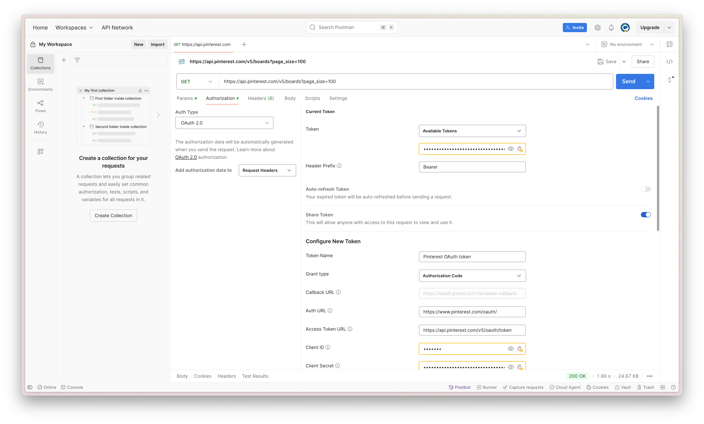

# API Journal

## Introduction
The goal of this assignment is to experience the power of the web by developing a web application just as attractive as native mobile apps with the help of web API's.

# 🪐 Week 1

### Concept
For the assignment we had to choose a app concept we wanted to remake with API's. I was immediately drawn to the idea of recreating an e-commerce or wishlist app. 

### API Research
#### Content API
For my API research I wanted to use an e-com content API with products I could use for the wishlist app. After checking out many API's, and almost two days passing by due to intensive research and reading documentation, I could only find suitable API's for payment or extremely limiting ones. API's I wanted to use in the first place or that I have considered where h&m API, Zara(home) API, Farfetch API, Bol API, Amazon API, Etsy API
I came to the conclusion that using the Pinterest API would be best suitable for my concept. But not knowing yet exactly what capabilities I have and what functions or ideas I can develop for my app with it, I had to adjust and adapt my concept a bit. To somewhat more general, like an app people can use their pins within.

#### Web API
The web API's that got my attention where the canvas API, color picker and view transitions. Not sure yet of what their capabilities are and what I can achieve with them, I decided to first start working with my content API and later implementing the web API for functionalities.

#### Sources for API's
🔗 SOURCE: https://rapidapi.com/hub

🔗 SOURCE: https://publicapis.dev/

🔗 SOURCE: https://developer.mozilla.org/en-US/docs/Web/API

#### API's I have researched
🔗 SOURCE: https://portal.api.hmgroup.com/

🔗 SOURCE: https://github.com/farfetch

🔗 SOURCE: https://developers.etsy.com/documentation/

🔗 SOURCE: https://apify.com/datasaurus/zarahome

🔗 SOURCE: https://www.retailed.io/datasources/api/zara-product

🔗 SOURCE: https://fakestoreapi.com/

#### Pinterest API
🔗 SOURCE: https://developers.pinterest.com/docs/api/v5/introduction

### Moodboard
Something I always use to get a visual representation of what I want to make, the look & feel and to gather inspiration is a moodboard. My moodboard for this project!

### Postman
As a way to get the authentication of the API to work, I used postman to try and achieve this, but mainly to see what data I get returned form the endpoints and to see what I can actually do with the API.

This also showed me how the data is structured and how I would have to write and use liquid to get data into my app. For example, when I get pins returned, they are returned in the array "items" and I get information such as the id, the id of the board it is in, the title, dominant color and multiple image sizes and the url I can use to add the image to my web app. 

# 🪩 Week 2

### Authorization  
#### With help of Cyd, ChatGPT and Claude

### Fetch pins data with endpoint
### Fetch boards with set amount pins
### Fetch boards by id

### Access down
#### Due to too many requests

# 🌶️ Week 3

### Authorization completion
### Drag and drop tutorial
### Drag and drop codepen with Cyd
#### Const error
#### Container --> dropzone
#### Script niet goed gelinked

