# API Journal

## Introduction
The goal of this assignment is to experience the power of the web by developing a web application just as attractive as native mobile apps with the help of web API's.

# 🪐 Week 1

### Concept
For the assignment we had to choose a app concept we wanted to remake with API's. I was immediately drawn to the idea of recreating an e-commerce or wishlist app. 

### API Research
#### Content API
For my API research I wanted to use an e-com content API with products I could use for the wishlist app. After checking out many API's, and almost two days passing by due to intensive research and reading documentation, I could only find suitable API's for payment or extremely limiting ones. API's I wanted to use in the first place or that I have considered where h&m API, Zara(home) API, Farfetch API, Bol API, Amazon API, Etsy API
I came to the conclusion that using the Pinterest API would be best suitable for my concept. But not knowing yet exactly what capabilities I have and what functions or ideas I can develop for my app with it, I had to adjust and adapt my concept a bit. To somewhat more general, like an app people can use their pins within.

#### Web API
The web API's that got my attention where the canvas API, color picker and view transitions. Not sure yet of what their capabilities are and what I can achieve with them, I decided to first start working with my content API and later implementing the web API for functionalities.
<br>
<br>

#### Sources for API's
🔗 SOURCE: https://rapidapi.com/hub

🔗 SOURCE: https://publicapis.dev/

🔗 SOURCE: https://developer.mozilla.org/en-US/docs/Web/API
<br>
<br>

#### API's I have researched
🔗 SOURCE: https://portal.api.hmgroup.com/

🔗 SOURCE: https://github.com/farfetch

🔗 SOURCE: https://developers.etsy.com/documentation/

🔗 SOURCE: https://apify.com/datasaurus/zarahome

🔗 SOURCE: https://www.retailed.io/datasources/api/zara-product

🔗 SOURCE: https://fakestoreapi.com/
<br>
<br>

#### Pinterest API
🔗 SOURCE: https://developers.pinterest.com/docs/api/v5/introduction
<br>
<br>

### Moodboard
Something I always use to get a visual representation of what I want to make, the look & feel and to gather inspiration is a moodboard. My moodboard for this project!


### Postman
As a way to get the authentication of the API to work, I used postman to try and achieve this, but mainly to see what data I get returned form the endpoints and to see what I can actually do with the API.

This also showed me how the data is structured and how I would have to write and use liquid to get data into my app. For example, when I get pins returned, they are returned in the array "items" and I get information such as the id, the id of the board it is in, the title, dominant color and multiple image sizes and the url I can use to add the image to my web app. 


# 🪩 Week 2

### Authorization
#### *With help of Cyd, ChatGPT and Claude*

#### 1 Start VScode & working API
To start my project, I used and forked an existing repository with all the needed files and base code already set up. 

The base server.js I worked with
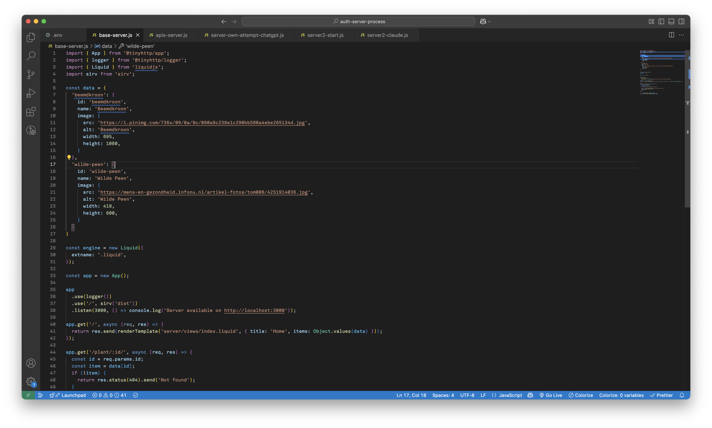

🔗 SOURCE: https://github.com/cmda-minor-web/API-2425

To learn how to get an API working, I tested adding and working with the data from some other API's. 

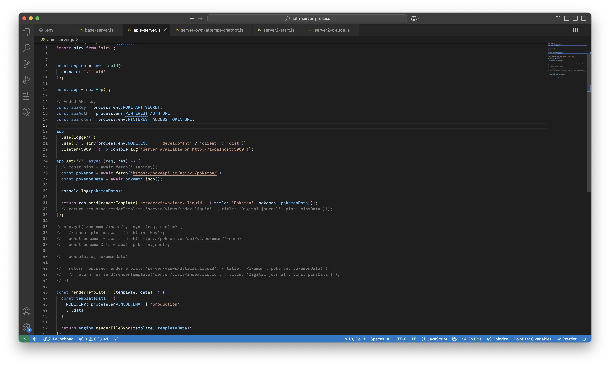

#### 2 My own attempt auth with ChatGPT
In an attempt to get the Pinterest API authorization to work I added the keys from my Pinterest app dashboard to the base server.js and to the .env file.

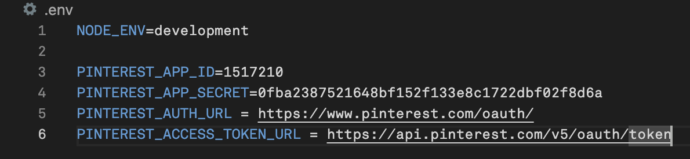

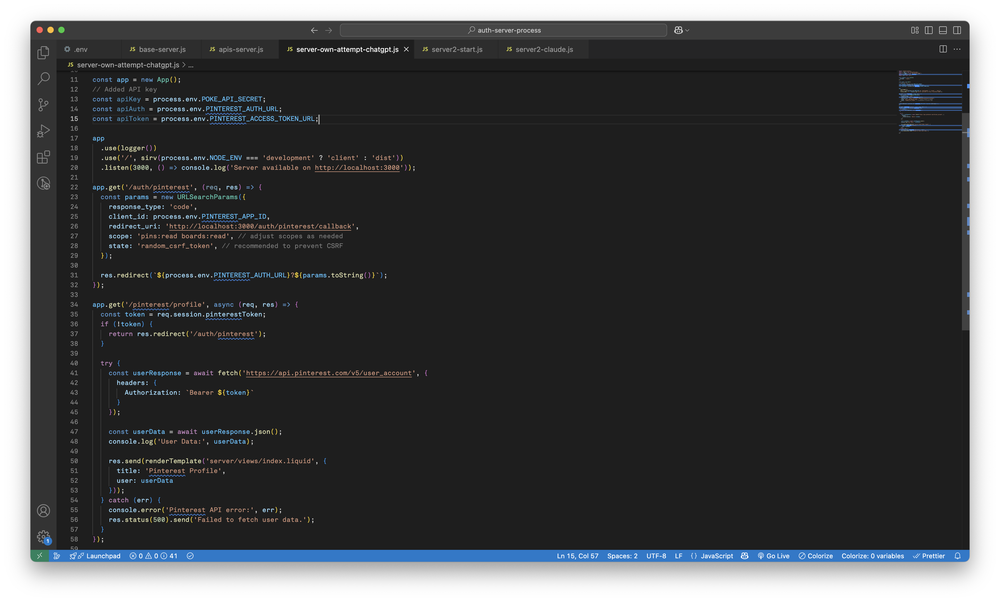

🔗 SOURCE CHATGPT: https://chatgpt.com/share/6814ded5-2578-8002-844e-e3c10b7f9574

#### 3 Auth with Cyd (& ClaudeAI)
After my own failed attempt to get the auth working, I asked Cyd for help. I already got pretty far on my own and for the fact that I had never worked with server side applications, content API's and/or data with liquid. But I realised it didn't work because I needed to generate the access token with the key and give/send it to the redirectUri. But I hadn't quite figured it out.

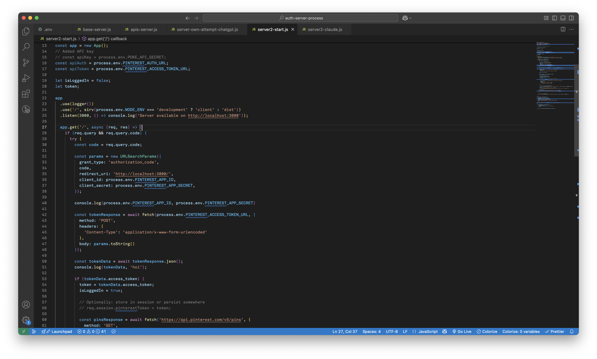

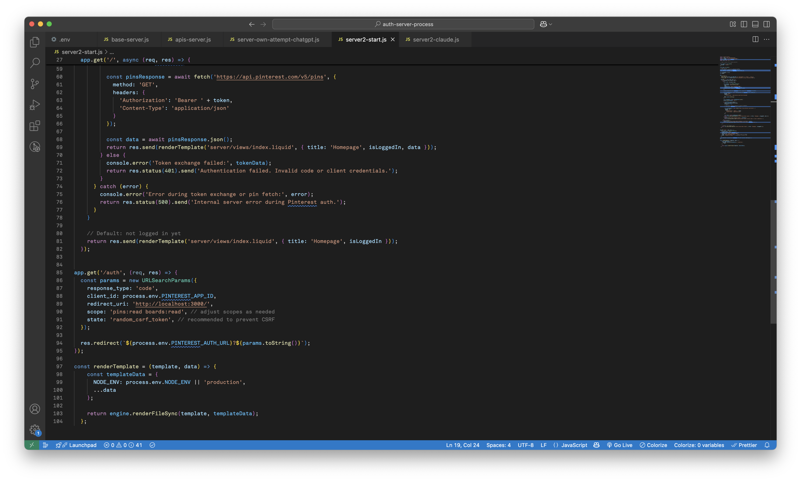
<br>

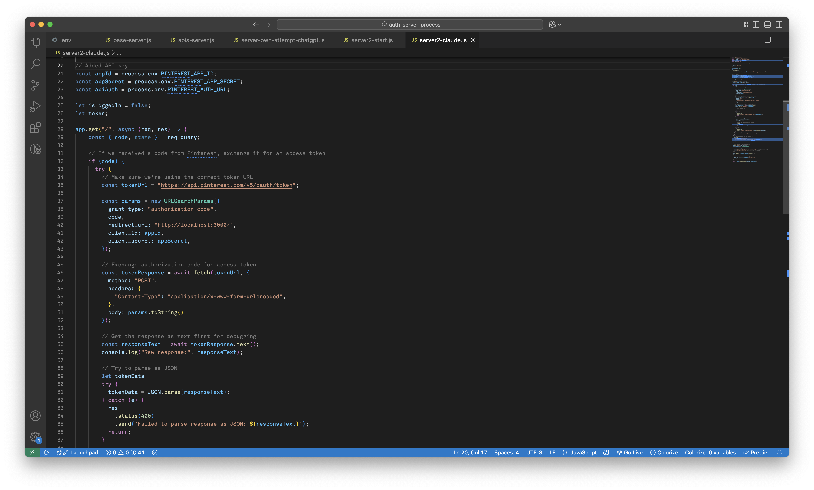

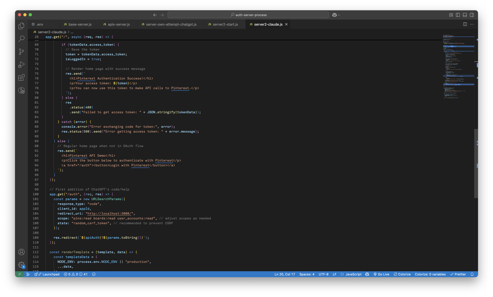
<br>

🔗 SOURCE CLAUDE first attempt: https://claude.ai/share/2da4d09a-be1b-4056-9198-5cac267f2d51
🔗 SOURCE CLAUDE token: https://claude.ai/share/9466f5e8-3738-470c-9863-87c1987fdd7e
<br>

After trying out a lot of things(see the file server2.js), techniques and debugging(with ClaudeAI), when we finally got close to something that worked we asked ClaudeAI to give the last code to make it work.

Which resulted into the following new and working auth:
<br>

🔗 SOURCE CLAUDE auth: https://claude.ai/share/8d019feb-5ea0-423e-a713-01c2d25097e1
<br>

```javascript
import "dotenv/config";
import { App } from "@tinyhttp/app";
import { logger } from "@tinyhttp/logger";
import { Liquid } from "liquidjs";
import sirv from "sirv";
import bodyParser from "body-parser";
import crypto from "crypto";

const engine = new Liquid({
  extname: ".liquid",
});

const app = new App();

// Environment variables
const appId = process.env.PINTEREST_APP_ID;
const appSecret = process.env.PINTEREST_APP_SECRET;
const redirectUri = process.env.REDIRECT_URI || "http://localhost:3000/callback";
const scope = "boards:read,pins:read"; // Adjust scope as needed
let token = {};

// Generate a random state for CSRF protection
const generateState = () => {
  return crypto.randomBytes(16).toString("hex");
};

// Setup middleware
app.use(logger());
app.use(bodyParser.json());
app.use(bodyParser.urlencoded({ extended: true }));
app.use('/', sirv(process.env.NODE_ENV === 'development' ? 'client' : 'dist'));
app.use('/public', sirv('public'));
  

// Route to initiate OAuth flow
app.get("/login", (req, res) => {
  const state = generateState();
  // Store state in a session or cookie for verification later

  const authUrl = new URL("https://www.pinterest.com/oauth/");
  authUrl.searchParams.append("client_id", appId);
  authUrl.searchParams.append("redirect_uri", redirectUri);
  authUrl.searchParams.append("response_type", "code");
  authUrl.searchParams.append("scope", scope);
  authUrl.searchParams.append("state", state);

  res.redirect(authUrl.toString());
});

// Callback route after authorization
app.get("/callback", async (req, res) => {
  const { code, state } = req.query;

  // Verify state matches what was sent (CSRF protection)
  // If not using session, you can skip this check for now

  try {
    // Exchange code for access token
    const tokenResponse = await fetch(
      "https://api.pinterest.com/v5/oauth/token",
      {
        method: "POST",
        headers: {
          "Content-Type": "application/x-www-form-urlencoded",
          Authorization: `Basic ${Buffer.from(`${appId}:${appSecret}`).toString(
            "base64"
          )}`,
        },
        body: new URLSearchParams({
          grant_type: "authorization_code",
          code,
          redirect_uri: redirectUri,
        }),
      }
    );

    if (!tokenResponse.ok) {
      throw new Error(`Token exchange failed: ${tokenResponse.statusText}`);
    }

    const tokenData = await tokenResponse.json();
    const { access_token, refresh_token } = tokenData;

    // Store tokens securely (in session, db, etc.)
    token = { access_token, refresh_token };

    // For demo purposes, we'll just display them
    res.redirect("/");
  } catch (error) {
    console.error("OAuth Error:", error);
    res.status(500).send(`Authentication error: ${error.message}`);
  }
});


// Home page
app.get("/", (req, res) => {
  res.send(`
    <h1>Pinterest API Integration</h1>
    <a href="/login">Login with Pinterest</a>
    `);
});

const renderTemplate = (template, data) => {
  const templateData = {
    NODE_ENV: process.env.NODE_ENV || "production",
    ...data,
  };

  return engine.renderFileSync(template, templateData);
};

// Start the server
app.listen(3000, () =>
  console.log("Server available on http://localhost:3000")
);
```
<br>

### Adjusted concept
While working on the authorisation of the API, I was able to see what sorts of data I get returned and I could start to imagine what I would actually do with it in therms of functionality and my concept of making some sort of web app in which users could immediately use their pins. Instead of a wishlist, that Iam not quite able to create with the Pinterest API, as expected. I decided to make a digital journal app in which users can drag and drop their pins from their boards and create spreads with them.

With this in mind, I proceeded to work on fetching data relevant for this concept, starting with pins and boards.

### Fetch pins data with endpoint
The first thing I needed, of course, were the pins. I fetched their data with the help of the Pinterest developers platform(see source).

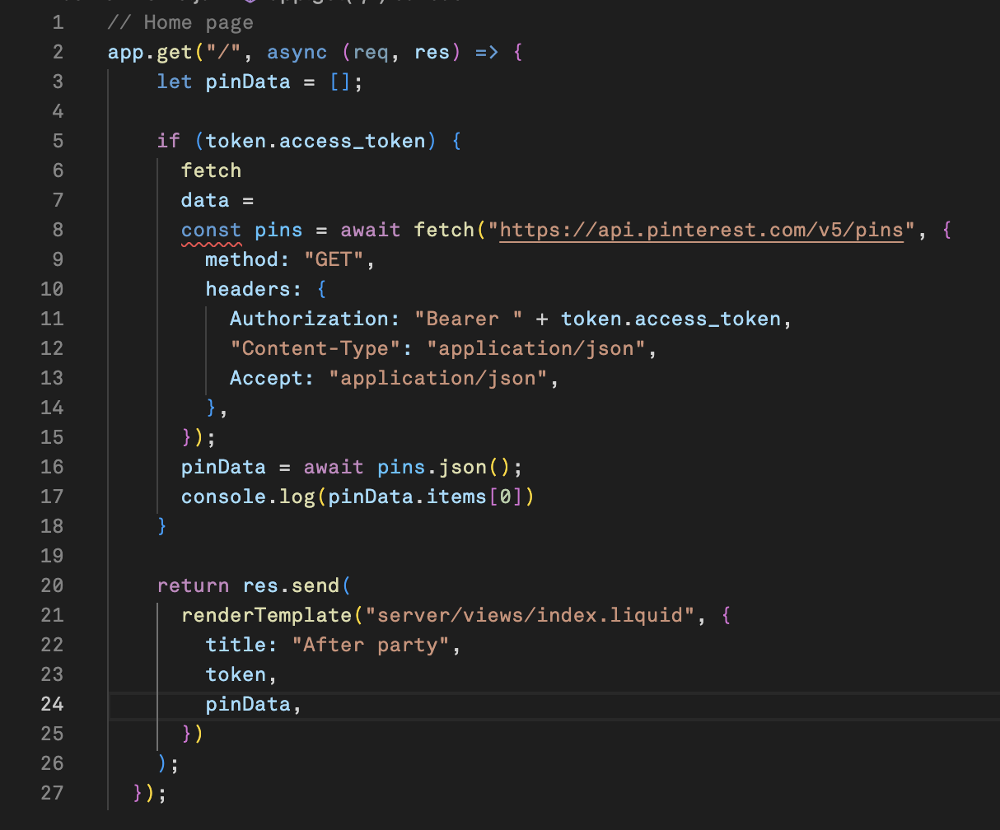
<br>

🔗 SOURCE Pinterest developer: https://developers.pinterest.com/docs/api/v5/pins-get/

### Use first data with liquid in HTML & CSS
Having fetched the pin data, I could use their data into my web app. Because I want to create a drag and drop function I loaded in the pins image url to visually show the pins in my web app.

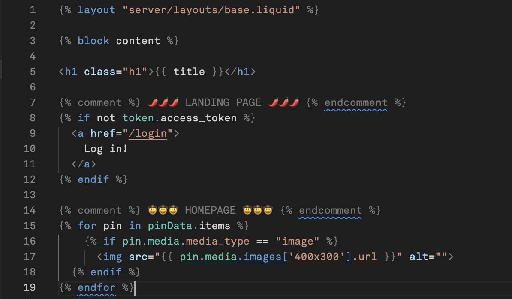

### Fetch boards
Having loaded the pins data, I got all of my latest pins into the web app, all from different boards. I realised it would be better to first fetch the boards and then the pins inside of them. 

At first I thought it didn't properly work, because not all of my boards were fetched, just a part of them. But I realised the default page load was 25 and I immediately changed it to a higher number with `?page_size=`.

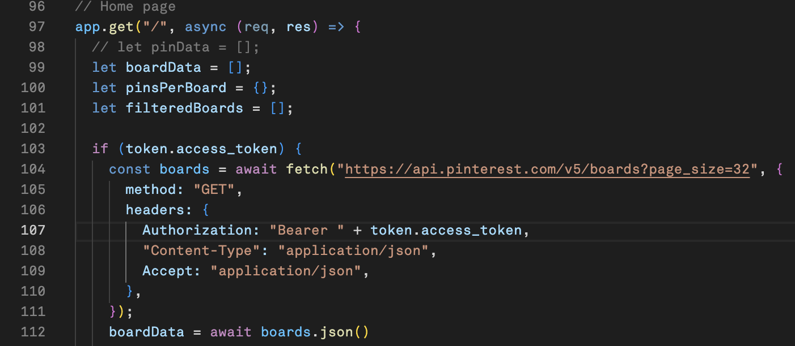
<br>

🔗 SOURCE Pinterest developer: https://developers.pinterest.com/docs/api/v5/boards-list
<br>

#### Adjust data in liquid HTML
To visually and interactively give the appearance of boards and their content/pins appearing I used the `<details>` element in HTML with the board cover being the `<summary>` and adding the board name as a heading. 

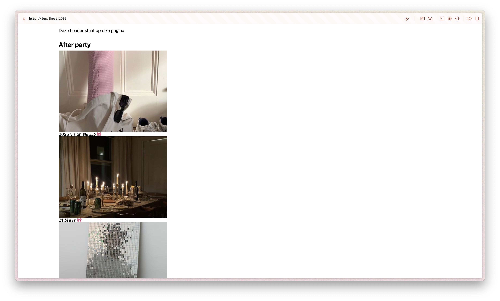


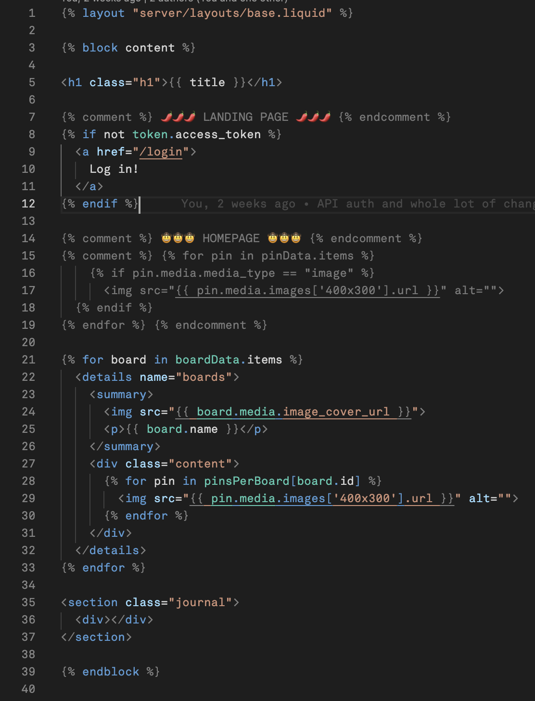
<br>

### Fetch boards per id and their pins(with help of Cyd)
I also realised, and saw, that fetching all the boards with all the pins inside, made the web app extremely slow and heavy. I decided to only fetch selected boards, suitable for the journal concept by using their id. 

To do so I used CoPilot and asked Cyd to help, and she confirmed that this is a way to achieve this. I created a new array in which I put the board id's of the boards I wanted to show. And used .filter to filter through the boards and return a board if the id is in the array with boards I choose. I then looped through the board indexes with a for function, beacause this one is an async function, that waits for the data to be loaded before executing. And returned the board if the id is in the array boardIds. Plus the pins inside of this board.

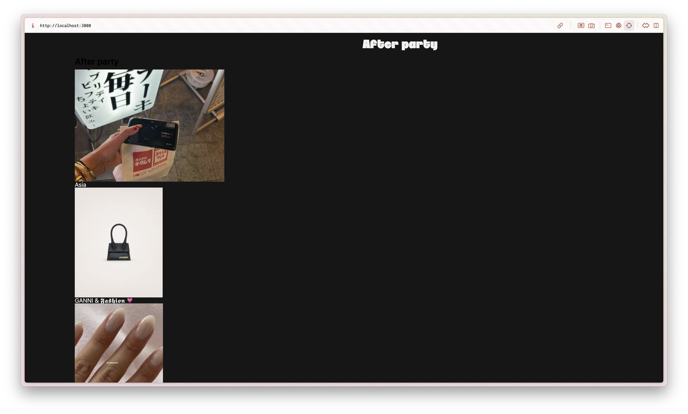

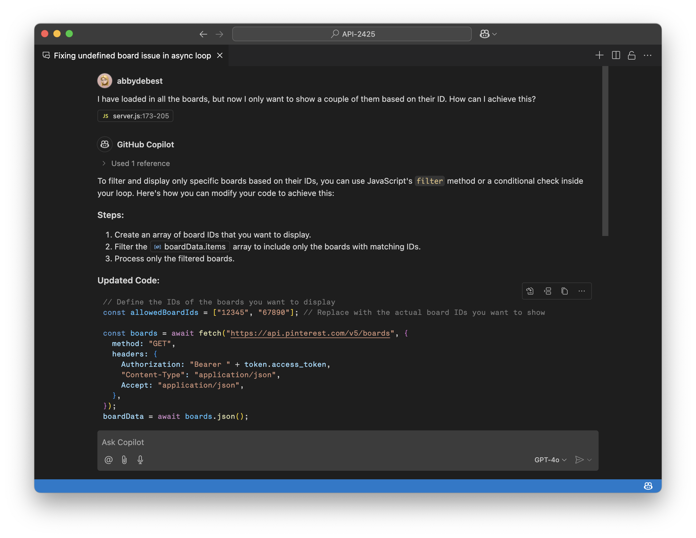

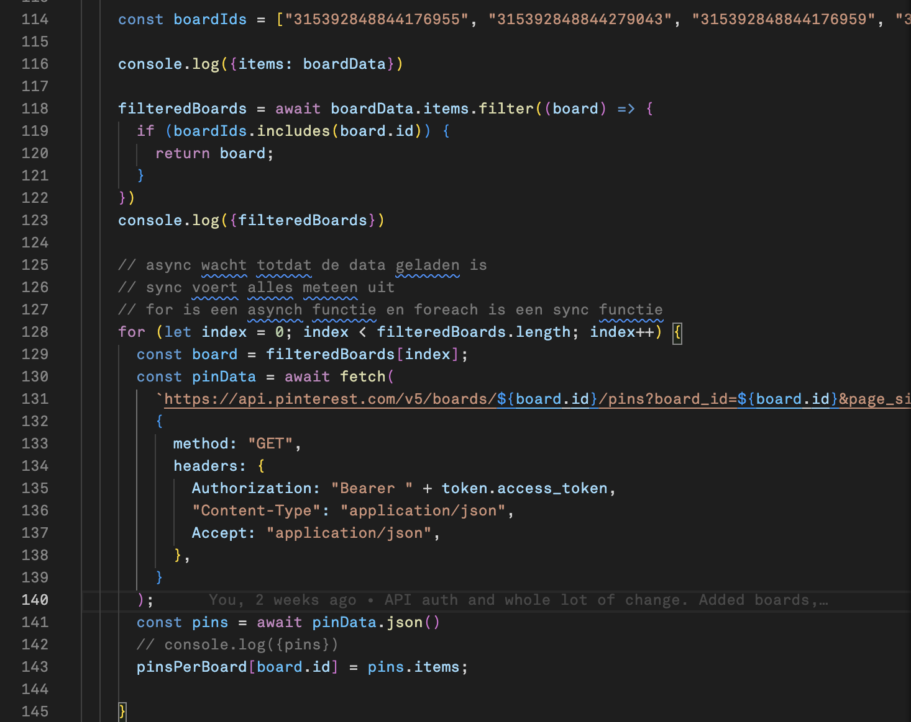
<br>

🔗 SOURCE Pinterest developer: https://developers.pinterest.com/docs/api/v5/boards-get

### Access down
#### *Due to too many requests*
Because I set the page load of the boards and the pins to a way to high number, I reached my max limit of requests and wasn't able to access my web app. A valuable lesson and something I immediately changed the next day.

# 🌶️ Week 3

### Journal section
Due to my restricted access and further developing my web app, I continued with working on the journal part for the drag & drop. To create the visual appearance of a journal I used a `<section>` with the class .journal, styled to be divided into two pages with a `::before` and `::after` element. The section also functions as container for the dropzone inside. 

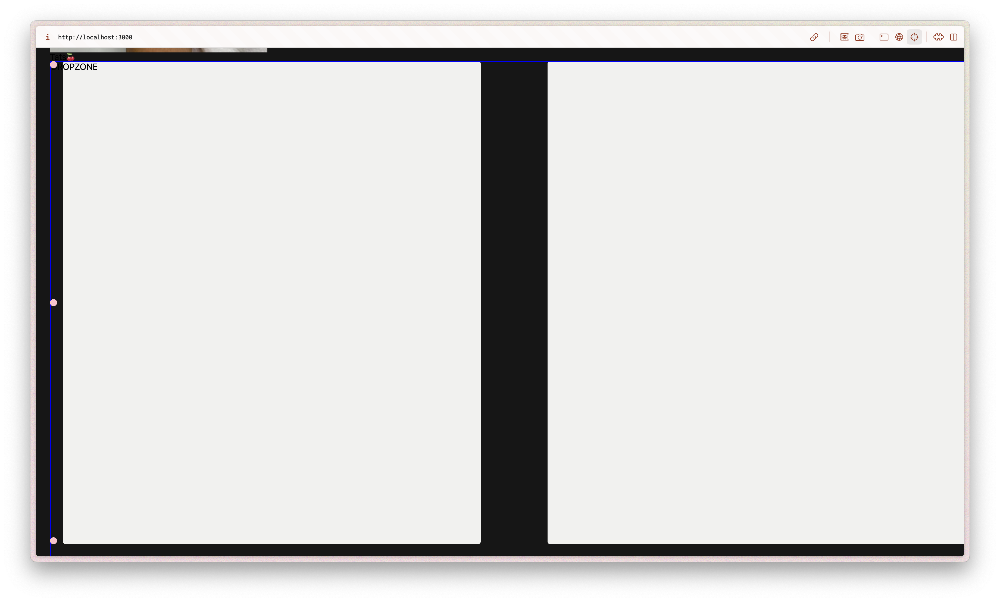

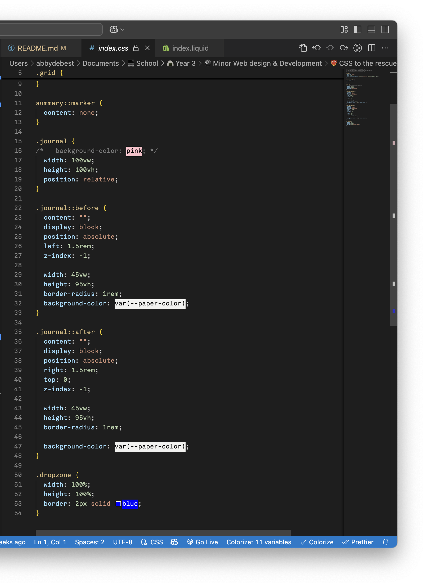
<br>

### Drag and drop tutorial
Simultaneously, I started working on the drag & drop function into this journal section. Because I had never used native HTML drag & drop before, I decided to use a tutorial to help me start. Because this was quite an experiment, I started making this in codepen, later migrating it into my code files.

To start the drag and drop, I defined the event listeners for the different parts of the function/action and define which elements/content is draggable and which element is the dropzone. By using `draggable="true"` and using classes.

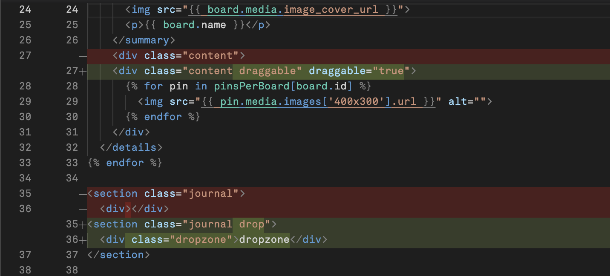

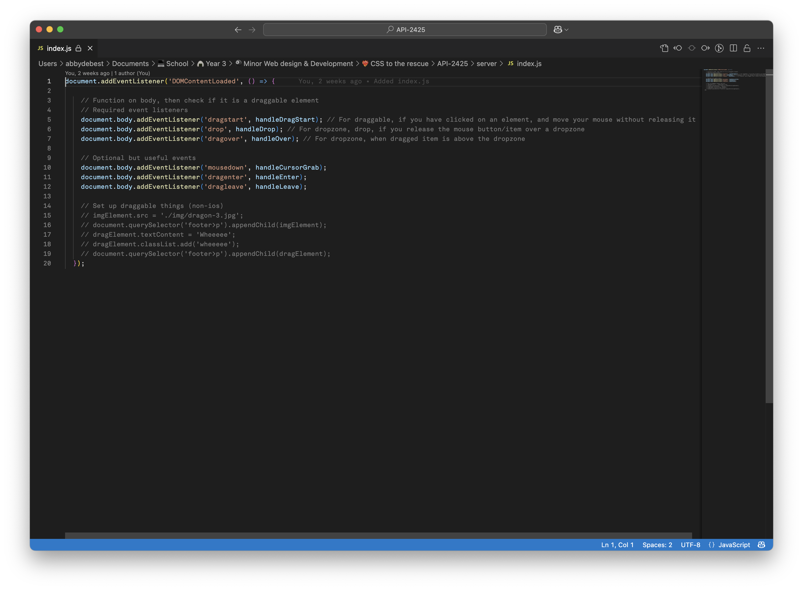
<br>

🔗 SOURCE tutorial: https://www.youtube.com/watch?v=Pje43sNdsaA
🔗 SOURCE MDN: https://developer.mozilla.org/en-US/docs/Web/API/HTML_Drag_and_Drop_API
<br>

#### My drag & drop code after following tutorial(wo json & timestamps)
After following through with most of the tutorial, the developer started using json and timestamps. A clever way to make the drag and drop work, but it felt devious and unnecessary. Which I tried to do easier and quicker by using the MDN source. Only this didn't work. I thought it had something to do with the data type or data I set or incorrect liking of the JS file.


<br>

### Drag and drop codepen with Cyd
Because the code I had written didn't work, and because I thought it was due to having to use json and timestamps. I asked Cyd for help and to find a way to rewrite this without having to use this. We found a simple codePen example, that makes it able to drag & drop by defining and adding the `event.listeners` to the draggable elements and the dropzone. After that setting a `data.status` to the element with `event.listener` and checking if the `target` contains contains 'dropzone' to check if it is the actual dropzone. Then add the `dataset.status` of hovered and dragleave to easily style the visual feedback. Lastly, adding the actual image on the drop `event.listener` using `cloneNode(true)`. 

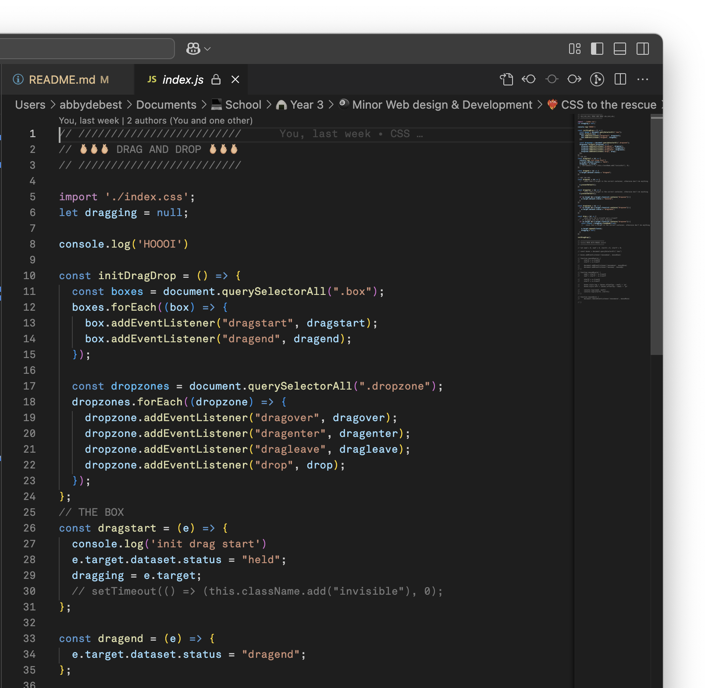

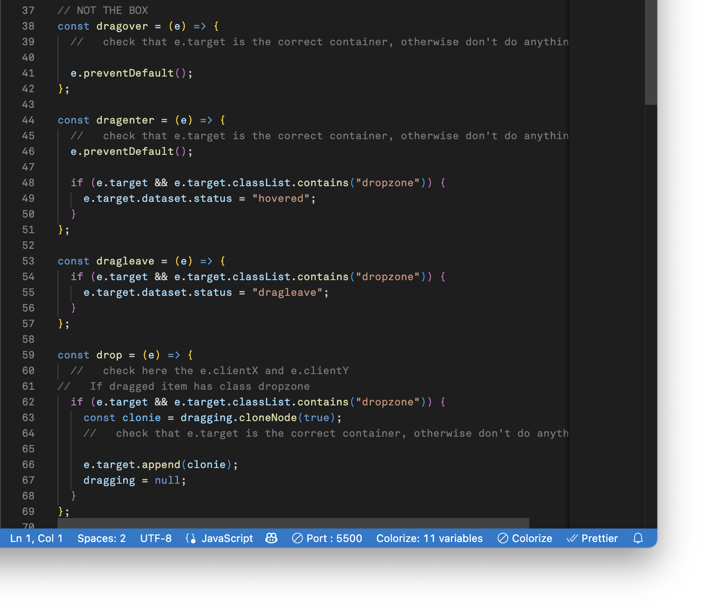
<br>

🔗 SOURCE: https://codepen.io/Sidstumple/pen/JooKbEm?editors=0110
<br>

#### Script not properly linked
I then changed some of the journal section styling and made it into two separate dropzones. When after having done all this, and the drag & drop still not working, so even with the new code Cyd and I wrote, I started doubting if the JS file was properly linked again. After looking into it together, the file was indeed not linked properly, because I had previously worked and coded in an index.js file on the server side, when I was supposed to work in the index.js file on the client side. Oops, rookie mistake! But when I changed this everything immediately worked! This also made me realise, that my own code might have worked after all, but I couldn't see because the script wasn't properly linked.

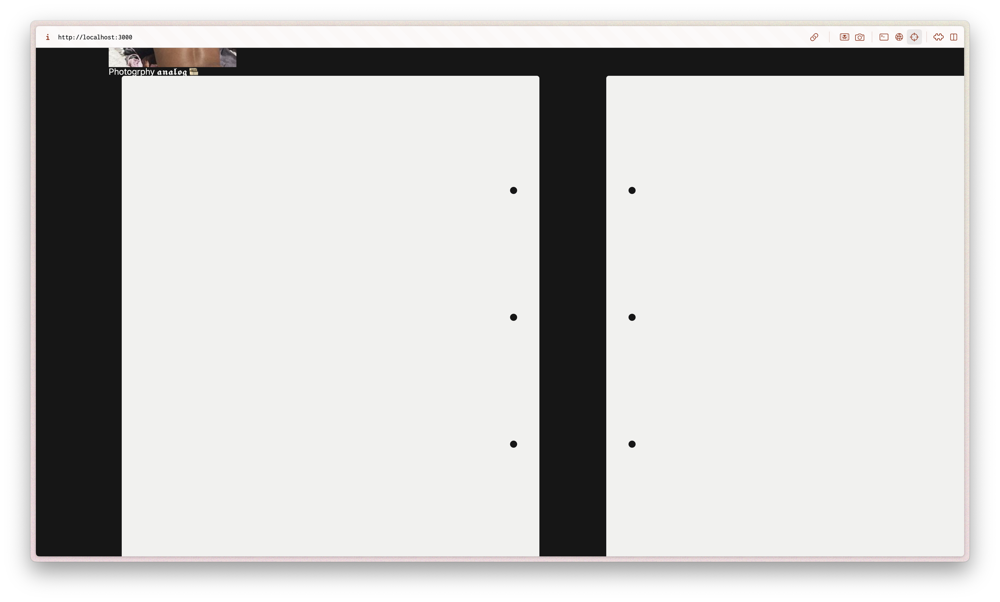

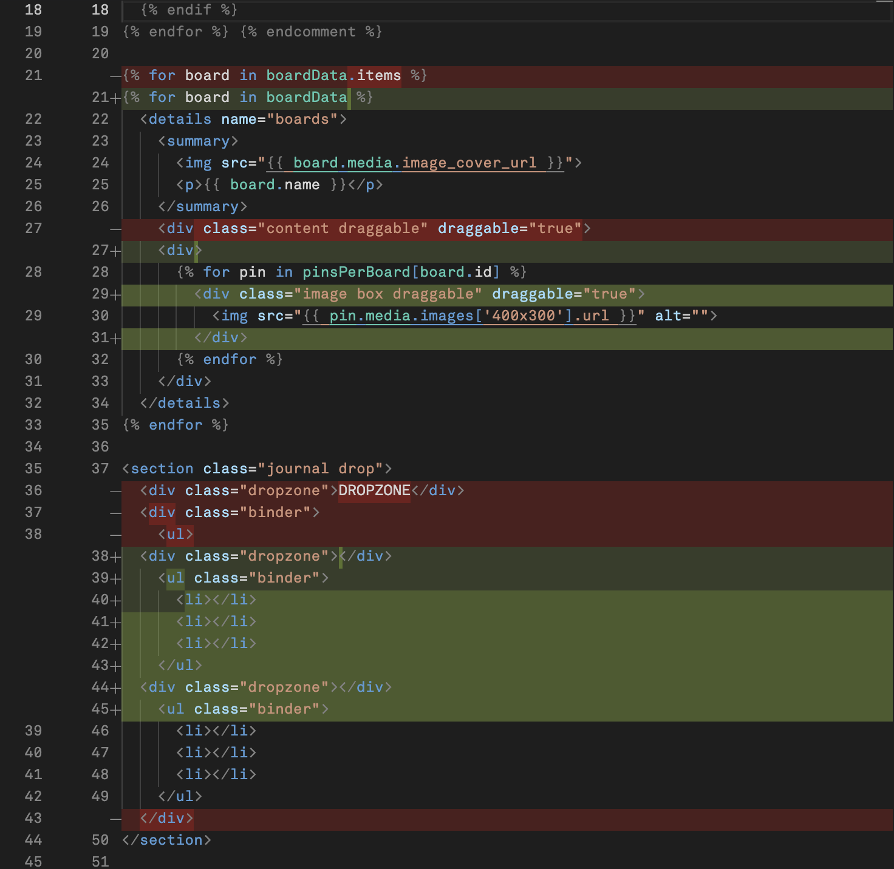
<br>

#### Const error
After dragging and dropping a couple images and seeing everthing worked in the console. Const error messages started to pop up. This was due to Pinterest not giving access to manipulate the content you fetch from their API(eventhough these are my own pins Iam trying to manipulate). Luckily, this was a quick fix by putting the image into a `<div>` as container and putting the `draggable="true"` attribute on this instead of the image itself.(see the code screenshot above)

### Working & stylable drag & drop
After all the debugging, when all the base functionalities finally worked. I was able to style and format the `dataSet.status` states. Due to using this technique it was super easy to style the dropzones and add some visual feedback.

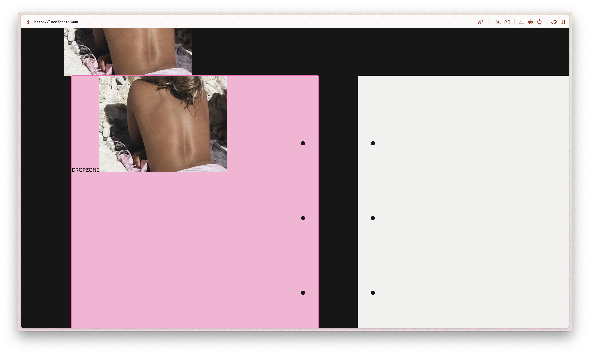

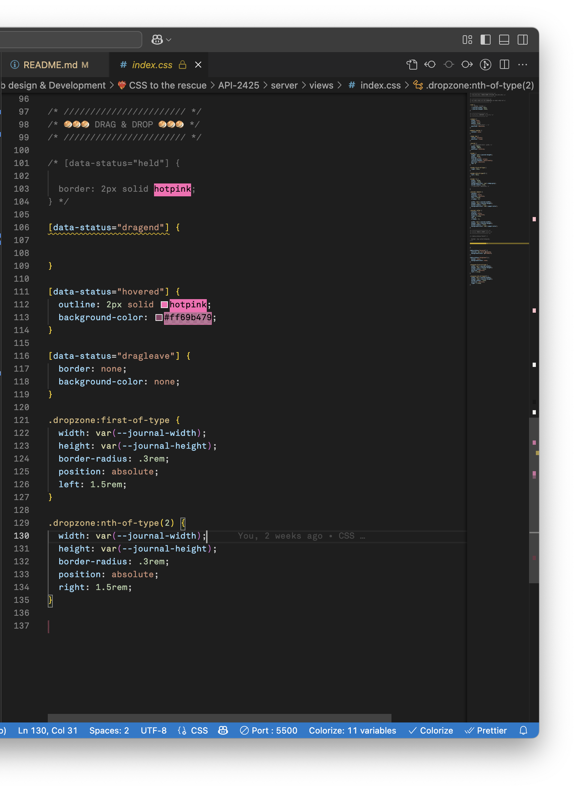
<br>

<!-- ////////////////// -->
<!-- 💥💥💥 WEEK 4 💥💥💥 -->
<!-- ////////////////// -->

# 💥 Week 4

### Move with mouse
Because I wanted to create an interactive drag & drop function, the next step to optimize it, is to make the content draggable around the whole dropzone, thus following the mouse. I followed another tutorial and added in some code to make this work.

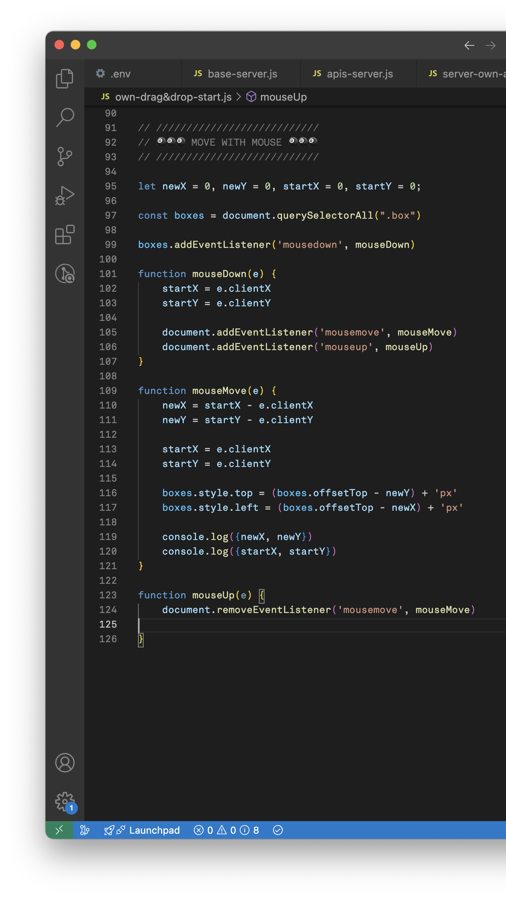

🔗 SOURCE: https://www.youtube.com/watch?v=ymDjvycjgUM
<br>

#### Causing problems
Later, when I went back to my live server, it looked as though my drag & drop did not work anymore. Not knowing what was causing problems, I returned to Cyd for help, and the CSS styling I implemented for the move with mouse function was interfering with the drag & drop function, due to different positions(absolute and fixed).

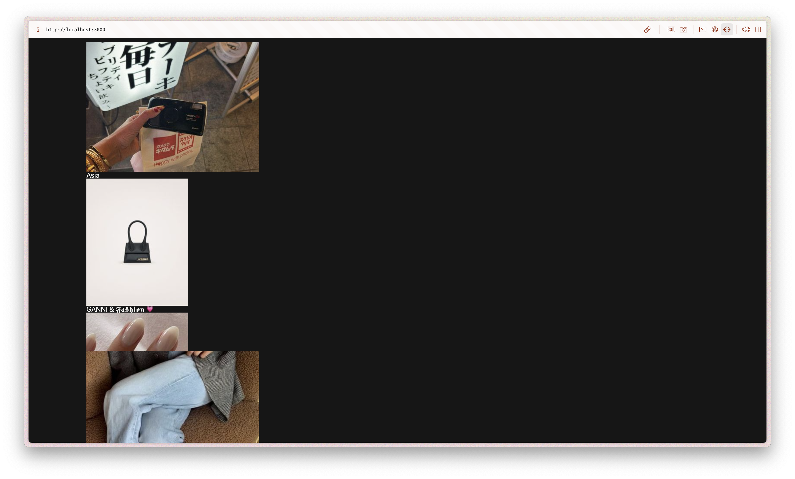
<br>

Cyd then backed up my idea to use an `<aside>` element and to use it as a container for the content and position that element instead of everything inside(that causes interference). When I changed this, the drag and drop worked again!

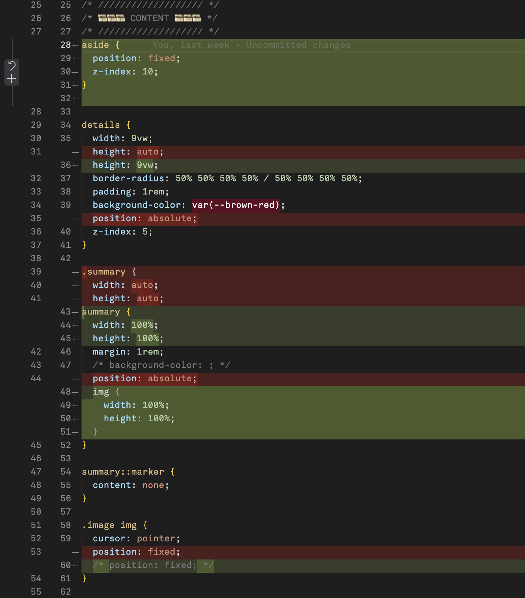


### Use 'old' and my own drag & drop
The fact that my index.js file wasn't linked properly before, made me think that my first drag & drop code(before asking help) might work with some tweaks, after all. But because the code in the tutorial used json and timestamps, which I preferred not to use, I had to change this. I thought to change the data to the imageURL with the `dataSet`, but still wasn't sure how, so I asked ClaudeAI. Which showed my the small changes to make and also made me understand the whole process even better. 

By indeed changing the data I send with the `dataSet` to the imageURL(on handleDragStart event), but of course also defining this data, by making the imageURL an object with the source. 

Then getting the data from the `dataSet`, which is the image source, after which creating an image(on the handleDrop event) with this source.

Lastly adding this image to the dropzone with `.append` and allowing the image to copy with `.dropEffect` on the dragEnd event.

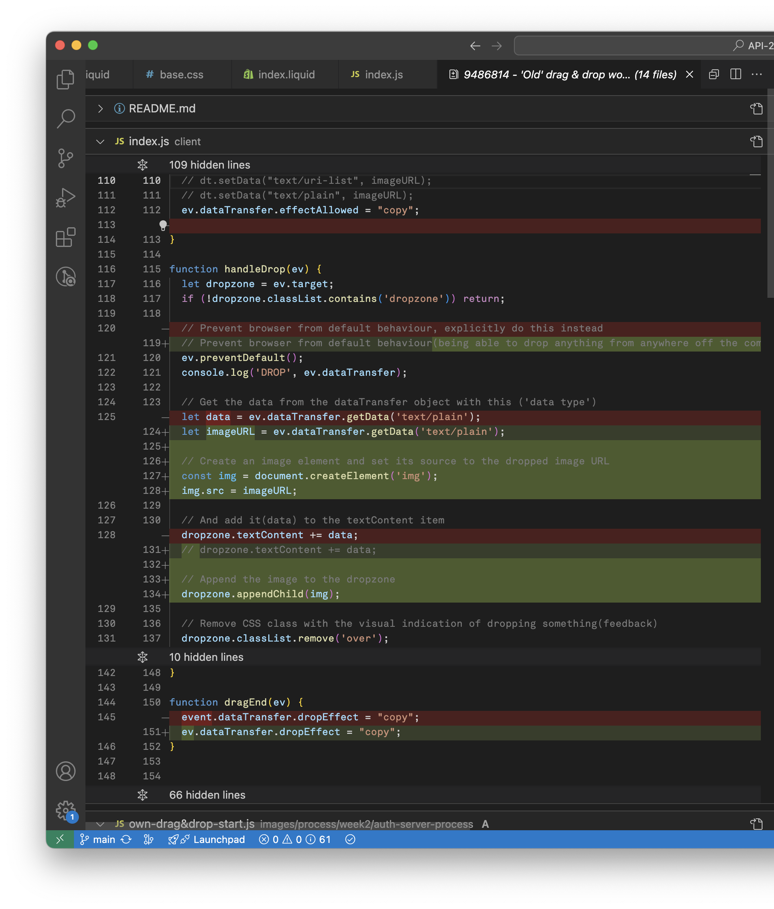

🔗 SOURCE ClaudeAI: https://claude.ai/share/b4594830-4141-4866-ae43-2b9c1ce7575c

### Mouse with mouse V2 functionality